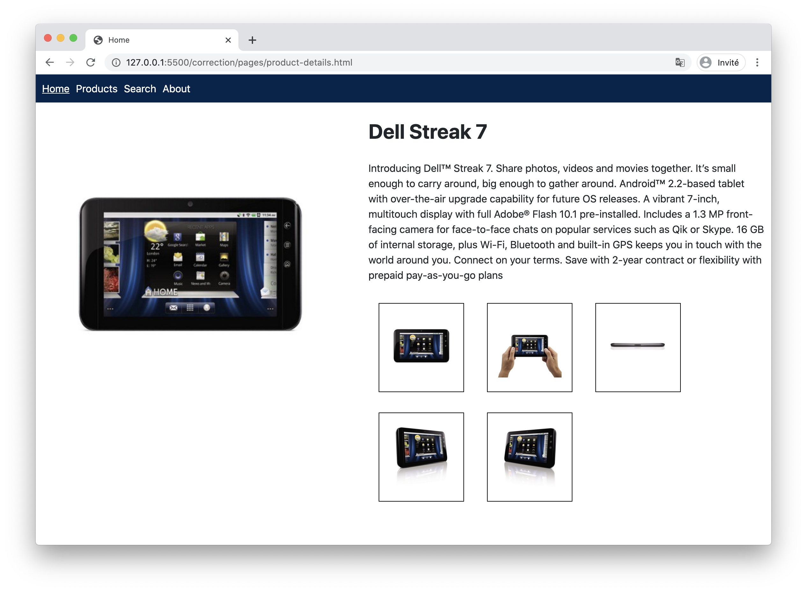

# Projet ST Web Basics

## Présentation

Nous voulons créer un catalogue de téléphones mobile sous forme d'application web.

Cette application aura 5 pages.

Un menu est commun aux 5 pages.

### Home

La page Home affiche 2 liens sous forme de boutons, un vers ST.com, l'autres vers la page produits.

### About

La page About affiche un paragraphe contenant le texte "ST Web Basics Project v1.0"

### Search

La page Search affiche un formulaire qui permettra de filtrer les recherches par :

* nom
* support de la radio FM ou non
* disponibilité chez les opérateurs

### Products

La page products affiche dans un tableau les résultats de recherches, éventuellement filtrés si des filtres ont été utilisés.

### Product Details

La page product details affiche le détail du produit :

* son nom
* sa description
* une photo
* une liste de photos en vignettes

## Etapes

* [Etape 1 : HTML](./steps/1-html.md)
* [Etape 2 : CSS](./steps/2-css.md)
* [Etape 3 : JS](./steps/3-javascript.md)
* [Etape 4 : Optionnel](./steps/4-optional.md)
