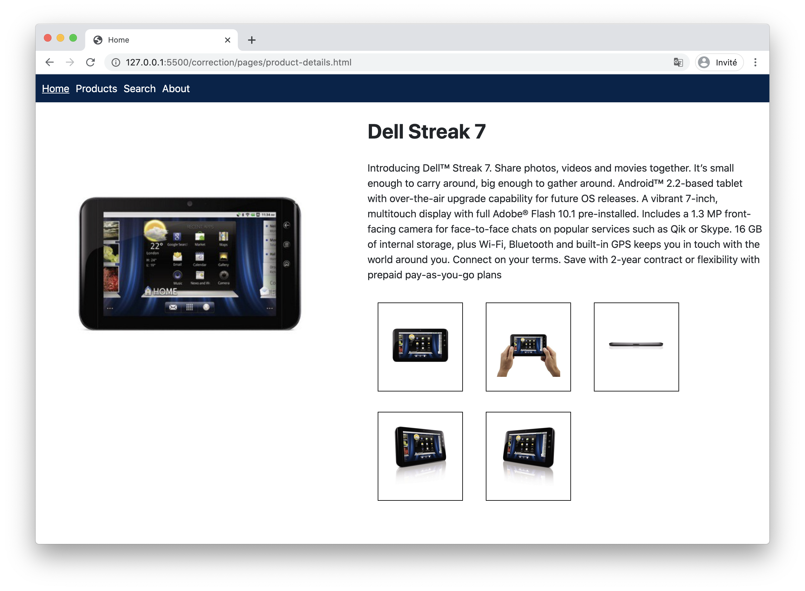
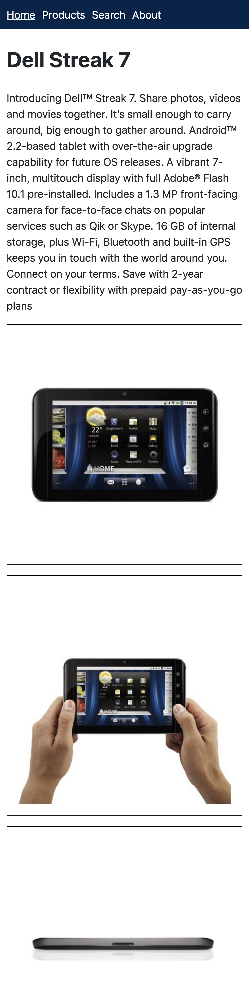

# Etape 2 - CSS

Dans le dossier `pages` créer un dossier `css` avec 4 fichiers :

* `common.css`
* `search.css`
* `products.css`
* `product-details.css`

### Fichier common.css

Le fichier `css/common.css` contiendra le CSS commun à toutes les pages notamment :

* la mise en forme du `body`
* la mise en forme du `header`
* la mise en forme du `main`
* la mise en forme des liens dont la classe est `btn-link`
* la couleur des liens autres que `btn-link`

#### Body

Utiliser le CSS suivant pour mettre en forme la balise `body` :

```
body {
  margin: 0;
  font-family: -apple-system, BlinkMacSystemFont, 'Segoe UI', Roboto,
    'Helvetica Neue', Arial, 'Noto Sans', sans-serif, 'Apple Color Emoji',
    'Segoe UI Emoji', 'Segoe UI Symbol', 'Noto Color Emoji';
  font-size: 1rem;
  font-weight: 400;
  line-height: 1.5;
  color: #212529;
  text-align: left;
  background-color: #fff;
}
```

#### Header

Mettre ensuite en forme le menu (balise `header`).

Le code couleur du fond est : `#03234b`

Mettre en forme le menu en utilisant les CSS Flexbox.

#### Main

La balise main à une `margin` de `10px` à chaque côté.

#### Liens Boutons

Les liens ayant la classe `btn-link` auront les caractéristiques suivantes :

* même fond bleu que le header
* texte blanc
* largeur du parent
* bords arrondis (`5px`)
* marge en bas (`10px`)
* texte centré
* padding de `10px` à chaque côté
* curseur avec la valeur `pointer`
* lien non-souligné

#### Autres liens

Les autres liens auront la même couleur de texte que le fond bleu du header

## Search

Mettre en forme la page search à votre guise

## Products

Voici le CSS à utiliser sur products.

Il faudra juste ajouter les règles suivantes :

* la première cellule (th ou td) de chaque ligne doit mesurer `200px` de large
* la dernière cellule (th ou td) de chaque ligne doit mesurer `50px` de large

```
table {
  width: 100%;
  table-layout: fixed;
  border-collapse: collapse;
  font-size: 12px;
}

td,
th {
  border: 1px solid rgba(0, 0, 0, 0.54);
  overflow: hidden;
  white-space: nowrap;
  text-overflow: ellipsis;
  padding: 5px;
}

th {
  background-color: #f5f7f7;
  color: rgba(0, 0, 0, 0.54);
}
```

## Product Details

Mettre en forme la page `product-details.html` au plus proche de la maquette :



En utilisant les media queries, créer une version mobile de cette page telle que si la largeur de viewport est inférieure à `768px` :

* La grande image ne s'affiche pas
* On affiche le titre en premier
* On affiche la description en second
* On affiche la liste des vignettes l'une sous l'autre (et non plus en colonne)

La version mobile devra ressemble à :



