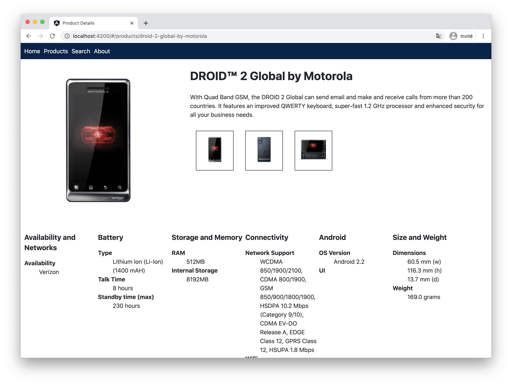
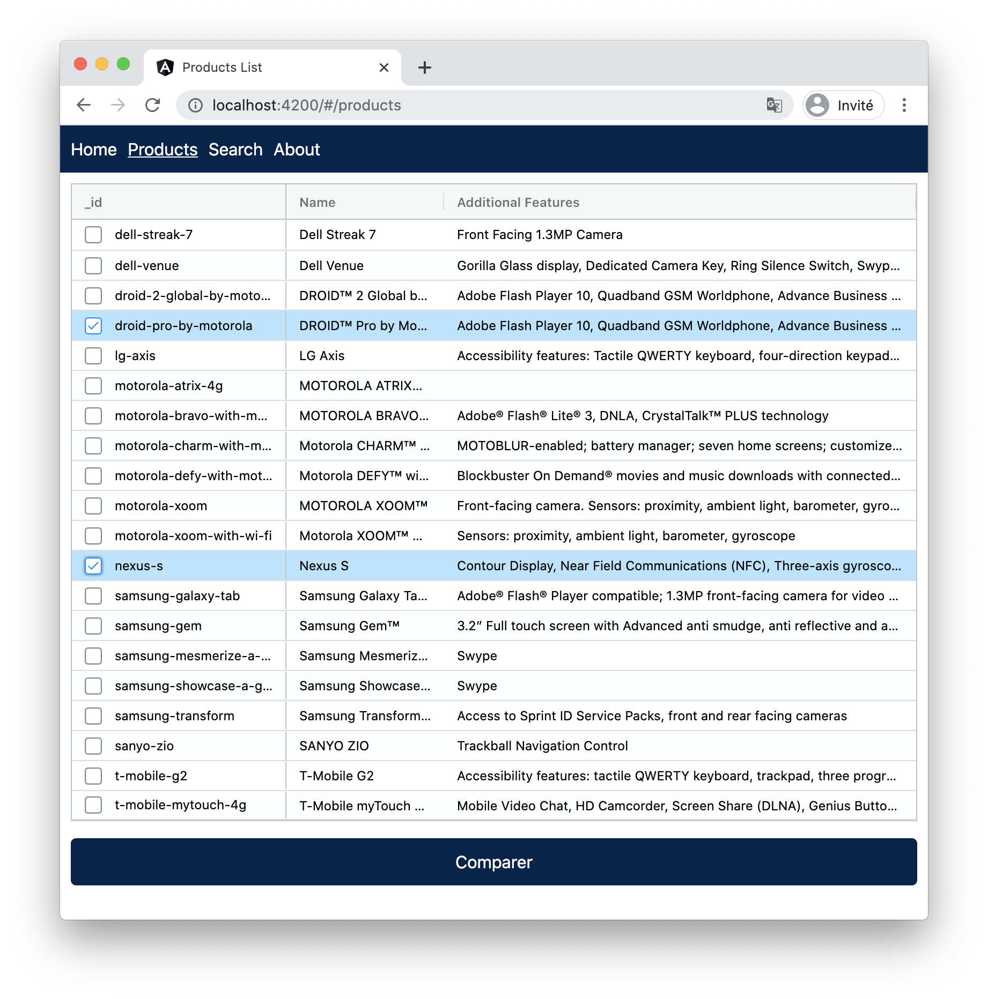
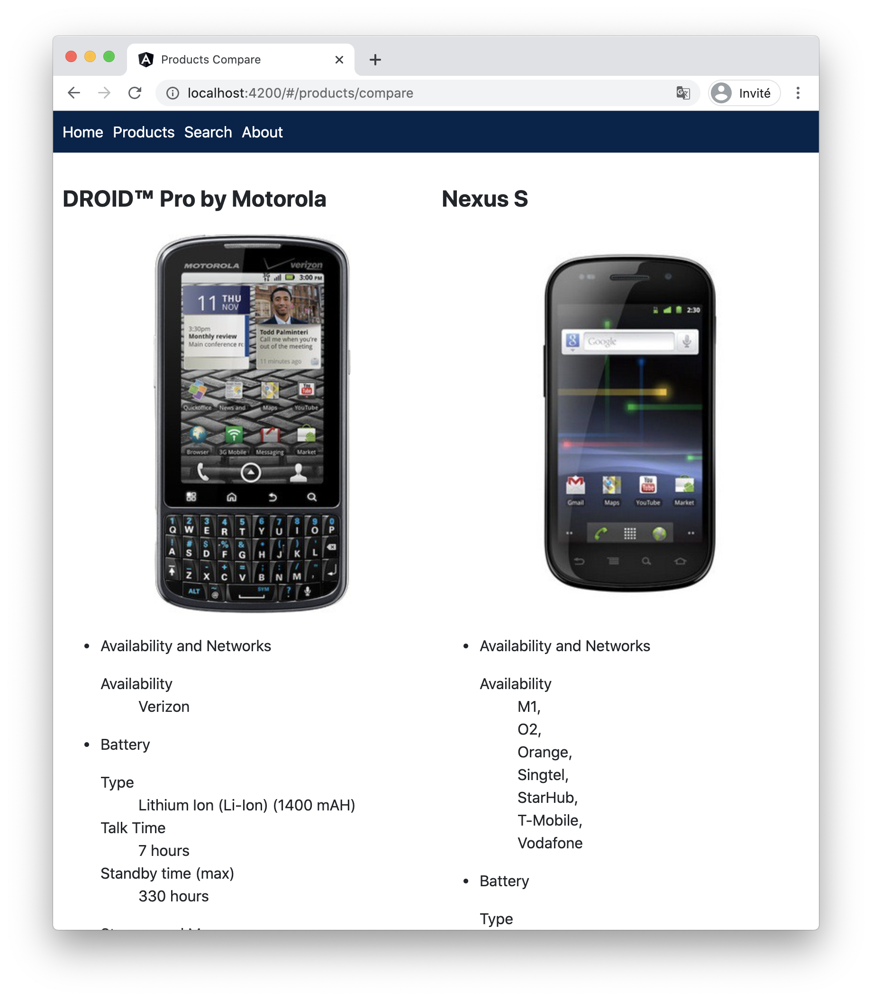
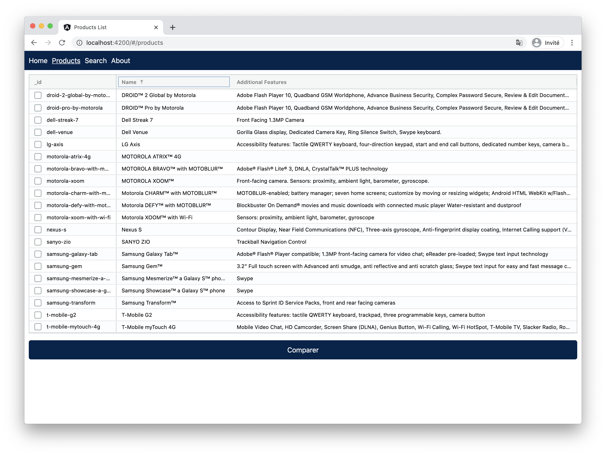

# Etape 4 - Optionnel

Pour ceux qui auraient terminé le projet avant la fin des 2 jours voici quelques améliorations qu'on pourrait lui apporter...

## Page Details

Afficher le reste des infos sur la page `product-details`, pour cela boucler sur toutes les clés/valeurs de l'objet `selectedProduct` sauf `_id`, `images`, `name`, `description` :

## Comparaison de produits

Sur la page `products`, ajouter des checkboxes en début de ligne et un bouton `Compare` en fin de page :

Lorsque l'on sélectionne plusieurs lignes en cliquant sur leur checkbox associée, le clic du lien `Compare` emmène vers une nouvelle page qui affiche les produits sélectionnés en colonnes (reprendre le code de la page details pour boucler sur les clés, seule la présentation diffère).

Limiter la comparaison à 3 produits.

## Tri du Tableau

Sur la page `products`, écouter le click des balises `th` et trier le tableau en conséquence :

